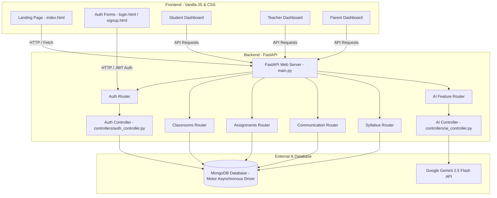
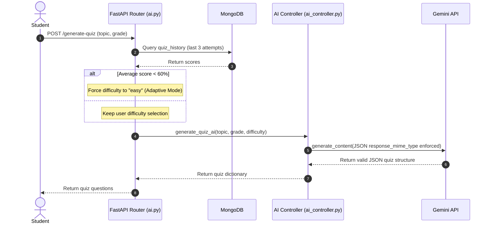

# EduFlow AI Codebase Analysis Report

This document provides a comprehensive, multi-dimensional technical analysis of the **EduFlow AI** learning platform codebase. EduFlow AI is a modern EdTech application designed to bridge teachers, students, and parents via interactive features, XP-based gamification, real-time messaging/notifications, and a suite of AI-driven study tools.

---

## 1. Architectural Overview

EduFlow AI utilizes a decoupled client-server architecture. The frontend is built on lightweight, modern **Vanilla HTML/CSS/JS** with rich animations, and the backend is an asynchronous **FastAPI** web server backed by **MongoDB**. 

### System Architecture Diagram

---

## 2. Backend Stack & Configurations

The backend directory contains the FastAPI server configuration and business logic. It relies on async IO principles to ensure scalable request throughput.

### Dependencies (`backend/requirements.txt`)
*   **FastAPI & Uvicorn**: ASGI framework and lightweight, high-performance web server.
*   **Motor**: Asynchronous MongoDB driver for Python.
*   **Pydantic (email)**: Schema modeling and data type validation (e.g. EmailStr).
*   **Bcrypt & PyJWT**: Cryptographic password hashing and JSON Web Token (JWT) authentication.
*   **Google GenerativeAI**: SDK to interface with Gemini models.
*   **Pillow & Python-Multipart**: Image rendering (for multimodal doubt-solving) and file uploads (for profile avatars).

### Database Engine (`backend/config/db.py`)
*   **Asynchronous Motor Client**: Implements `AsyncIOMotorClient` to support concurrent database connections.
*   **Automated Purge & Lifecycle Management**:
    *   Creates a **TTL Index** on `notifications` collection which automatically deletes items after 30 days.
    *   Runs a startup purge querying and deleting already read notifications older than 7 days using `delete_many`.

---

## 3. Database Schema Models (`backend/models/`)

The database collection schemas are defined using **Pydantic** models, ensuring strict data contract validation at all API boundaries.

| Model / Collection | Fields | Purpose / Description |
| :--- | :--- | :--- |
| **User** (`user.py`) | `id`, `name`, `email`, `role` (teacher/student/parent), `password`, `xp`, `level`, `badges`, `parent_email`, `class_codes`, `phone`, `bio`, `profile_pic`, `grade`, `school`, `qualification`, `subject`, `relationship`, `linked_student_emails`, `tutor_persona` | Core model containing authentication profiles, connection linkages, and gamification metrics. |
| **Classroom** (`classroom.py`) | `class_code` (6-char UID), `class_name`, `teacher_id`, `teacher_name`, `students` (list of sub-objects) | Tracks classroom info, student rosters, announcements, comments, and teacher linkages. |
| **Assignment** (`assignment.py`) | `id`, `class_code`, `title`, `description`, `assignment_type` (manual/ai/link), `due_date`, `max_marks`, `gdrive_link`, `ai_questions` | Stores worksheets or quizzes created by teachers for classes. |
| **Submission** (`assignment.py`) | `id`, `assignment_id`, `student_id`, `student_name`, `student_email`, `status` (pending/submitted/graded), `submission_text`, `answers`, `submitted_at`, `grade`, `teacher_remarks` | Tracks student homework submissions and grades. |
| **Syllabus** (`syllabus.py`) | `grade`, `subject`, `chapters` (list of chapter number, chapter name, subtopics) | Static lookup database representing the NCERT curriculum mapping. |
| **Study Kanban** (`ai.py`) | `id`, `user_id`, `subject`, `grade`, `tasks` (list of task id, title, status) | Stores personalized AI-generated task boards for students. |

---

## 4. API Endpoints & Core Logic (`backend/routes/`)

The backend codebase is organized into modules using FastAPI `APIRouter`:

### A. Authentication & Profiles (`auth.py`)
*   `POST /signup` & `/login`: Handles user account creation and secure JWT issuance. Includes validations to verify database roles match frontend selections.
*   `GET /me` & `PUT /profile`: Retreives or updates details of the authenticated user. Includes a custom phone number normalization function.
*   `POST /profile/avatar`: Uploads and saves profile picture avatars locally to `static/avatars/`.
*   `POST /stats/add-xp`: Validates client-driven requests to award XP based on completed tasks.
    *   **XP Gamification Rules**: Doubt solutions award 50 XP, study plans award 30 XP, and quiz scores award up to 200 XP (20 XP per question). Every 500 XP triggers a Level Up. Badges are unlocked dynamically (e.g. *Quiz Master*, *Doubt Buster*, *Master Planner*, *Gemini Scholar*).
*   `POST /parent/link-student` & `GET /parent/linked-students`: Allows parents to link to a student email and inspect child metrics.
*   `POST /teacher/create-classroom` & `POST /student/join-classroom`: Orchestrates classroom creation (6-character code) and enrollment.

### B. Classrooms & Feeds (`classrooms.py`)
*   `POST /announcements`: Enables teachers to post text updates. Triggers notifications for enrolled students and linked parents.
*   `POST /announcements/{id}/like` & `/comment`: Implements social style feed interactions (toggling likes and appending comments).
*   `GET /leaderboard`: Returns classroom members sorted by total XP descending to encourage competition.
*   `GET /notifications` & `DELETE /notifications`: Manages personal real-time notification feeds.
*   `DELETE /{class_code}`: Implements cascading delete sequence (removing enrollment arrays from students, deleting announcements, comments, assignments, submissions, and notifications linked to the class).

### C. Assignments Hub (`assignments.py`)
*   `POST /create`: Teachers publish manuals, links, or AI-generated quizzes. Generates notifications for students and parents.
*   `POST /{id}/submit`: Student uploads answers. Prevents resubmission if already graded, and awards **+50 XP** on first submit.
*   `POST /submission/{id}/grade`: Teacher assigns marks and remarks. Prevents grading higher than `max_marks`. Triggers grading notifications.

### D. Direct Messaging (`communication.py`)
*   `GET /contacts`: Limits contacts dynamically (students see class teachers, teachers see enrolled students and parents, parents see classroom teachers of their children).
*   `GET /messages/{contact_id}` & `POST /send`: Implements direct text message histories.

### E. AI Services & Personalization (`ai.py` & `controllers/ai_controller.py`)
This is the intellectual engine of EduFlow AI. It calls the Gemini API to power intelligent learning loops:

1.  **AI Study Plan**: Generates weekly revision routines and motivation checklists based on weak topics.
2.  **Multimodal Doubt Solver**: Resolves user queries using text, images/screenshots, or both. Tailors explanations according to a chosen **Tutor Persona**:
    *   `socratic`: Explains concepts and asks guiding questions without giving the direct answer.
    *   `analogy`: Explains science/math concepts using everyday stories and simple comparisons.
    *   `exam`: Coach style concise bullet points, highlighting formulas, and exam tips.
3.  **Adaptive Quizzes**: Generates JSON objects containing questions, options, correct answers, and explanations. 
    *   *Adaptive Logic*: Scans the last 3 quiz scores from `quiz_history`; if the average score is under 60%, it forces the Gemini generator to output `easy` difficulty to rebuild student confidence.
4.  **AI Lesson Planner (for Teachers)**: Aggregates student quiz scores across a classroom, detects the lowest average topic, and creates a 50-minute teaching lesson plan detailing common misconceptions, lecture outlines, and remedial exit tickets.
5.  **Parent Revision Guide**: Aggregates child score histories, identifies weak topics, and generates a guide explaining the concept using home analogies, along with a 3-question practice worksheet and step-by-step solutions for parents to review.

---

## 5. Frontend Architecture

The client-side codebase is built with responsive UI modules using vanilla Web standards, avoiding dependencies on single-page-app (SPA) frameworks.

### Code Organization
*   `index.html` & `css/style.css`: Landing page showcasing platform values, timelines, role cards, and animated counts.
*   `pages/login.html` & `pages/signup.html`: Styled with `css/auth.css` using modern glassmorphism inputs and split panels.
*   `js/auth.js`: Manages login/signup submissions, tab states, validation handlers, and a global **Toast Notification system** containing offline detection and live reconnect button.
*   `js/student_dashboard.js`: The largest frontend codebase. Implements:
    *   *Kanban Study Board*: HTML5 Drag & Drop event bindings to update tasks on the server database.
    *   *Doubt Solver Box*: Integrates Web Speech Recognition API (microphone audio query capture) and drag & drop image uploads.
    *   *Quiz Engine*: Manages countdown timers, gamified **Bot Battle Mode** (HP hearts, bot attack animations on wrong answers, player health indicators), and option feedback colors.
    *   *3D Flashcards*: Card flipping animations using CSS transformation transforms.
*   `js/teacher_dashboard.js` & `js/parent_dashboard.js`: Populate progress indicators, charts, rosters, print-friendly quiz generators, and custom AI lesson guides.

---

## 6. Testing Infrastructure (`backend/tests/`)

EduFlow AI includes a robust test suite validating backend operations:

### `test_ai_agent_tools.py`
This test file implements direct database integration and API mocking to ensure correctness of core logic:
1.  **Tutor Persona Prompt Validation**: Uses `unittest.mock.patch` to capture prompts sent to the Gemini API and asserts that selected persona instructions (Socratic warnings, analogy cues, exam highlights) are properly injected.
2.  **Quiz Generation Formats**: Asserts prompt parameters are correctly formatted for True/False and Fill-in-the-blank type questions.
3.  **Phone Number Normalization Rules**: Runs assertions verifying that symbols, spaces, prefixes, and leading zeros are correctly stripped.
4.  **Academic Privacy Scoping**: Verifies that when a teacher queries a student's quiz history, only quizzes matching the teacher's classroom subject are returned (maintaining grade privacy between teachers).
5.  **Database Pagination**: Validates database `skip` and `limit` boundaries on quiz lists.

---

## 7. Analysis & Recommendations

EduFlow AI is an excellently crafted codebase, built with strict decoupling, clean schema validations, and high-quality user features. 

### Key Highlights
*   **Structured JSON Output from AI**: Relying on Gemini's `response_mime_type: "application/json"` ensures that AI features (quizzes, flashcards, kanban boards) load reliably without parsing errors.
*   **Asynchronous Operations**: Using async MongoDB clients and routes prevents blockages on database operations, ensuring scalability.
*   **Robust Client Feedback**: The offline retry toast notification enhances UX by handling server disconnects gracefully.

### Recommendations for Production
*   **API Security**: Implement token-based rate limiting (like slowapi) on endpoints that call the Gemini API (`/solve-doubt`, `/generate-quiz`) to prevent abuse and API key cost inflation.
*   **Asset Storage**: Move static uploads (`static/avatars/`) to an external cloud bucket (like AWS S3 or Google Cloud Storage) if deploying to horizontal-scaling container instances (such as Render or Docker clusters) where local container disks are ephemeral.
*   **Database Indexes**: Add secondary database indexes on query filters such as `user_id` and `class_code` to speed up lookups as the collections scale.
